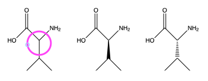

# Chemical structures in chemistry files
Important chemistry files including chemical structures

extension|source|Extraction tool
----|----|---
.cdx|ChemDraw|OpenBabel
.g03|Gaussia98/03|[OpenBabel](#OpenBabel)
.sdf|multiple open sources|[OpenBabel](#OpenBabel)
.mnova|MestreNova|[Mnova](#Mnova)

## OpenBabel
conversion into .mol file using [OpenBabel](https://open-babel.readthedocs.io/en/latest/)
```
obabel inputfile.sdf -O outputfile.mol
obabel inputfile.cdx -O outputfile.mol
obabel -ig03 inputfile.log -O outputfile.mol
```
conversion into image using OpenBabel
```
obabel outputfile.mol -O outputfile.png
```
## Mnova
[Mnova](https://mestrelab.com/download/mnova/) requires a [licence](https://www.unige.ch/sciences/chiorg/mnova/).
Extraction done using a script called from unix:
```
/usr/bin/mnova "/usr/username/myScript.qs" -sf "myFunction",0.1,10,true,off // generic for user-defined script
/usr/bin/mnova "NMReDATAExporter.qs" //for NMReDATA - this script my be a starting point for a user-defined script to write
babel -isdf  'mymols.cdx' -omol 'outputfile.mol' //if the data are not in .mol format already
```
# Visualization of .mol files

extension|source|Visualization tool|demo
----|----|---|---
.mol|any structure|[JSmol](http://wiki.jmol.org/index.php/Jmol_JavaScript_Object#JSmol)|[Structure of indole](https://www.simolecule.com/cdkdepict/depict/bow/svg?smi=indole%0A%20%20NextMove10101914192D%0A%0A%20%209%2010%20%200%20%200%20%200%20%200%20%200%20%200%20%200%20%200999%20V2000%0A%20%20%20%201.7200%20%20%20-1.2100%20%20%20%200.0000%20N%20%20%200%20%200%0A%20%20%20%202.6000%20%20%20-0.0000%20%20%20%200.0000%20C%20%20%200%20%200%0A%20%20%20%201.7200%20%20%20%201.2100%20%20%20%200.0000%20C%20%20%200%20%200%0A%20%20%20%200.2900%20%20%20%200.7500%20%20%20%200.0000%20C%20%20%200%20%200%0A%20%20%20-1.0100%20%20%20%201.5000%20%20%20%200.0000%20C%20%20%200%20%200%0A%20%20%20-2.3100%20%20%20%200.7500%20%20%20%200.0000%20C%20%20%200%20%200%0A%20%20%20-2.3100%20%20%20-0.7500%20%20%20%200.0000%20C%20%20%200%20%200%0A%20%20%20-1.0100%20%20%20-1.5000%20%20%20%200.0000%20C%20%20%200%20%200%0A%20%20%20%200.2900%20%20%20-0.7500%20%20%20%200.0000%20C%20%20%200%20%200%0A%20%201%20%202%20%201%20%200%0A%20%202%20%203%20%202%20%200%0A%20%203%20%204%20%201%20%200%0A%20%204%20%205%20%202%20%200%0A%20%205%20%206%20%201%20%200%0A%20%206%20%207%20%202%20%200%0A%20%207%20%208%20%201%20%200%0A%20%208%20%209%20%202%20%200%0A%20%201%20%209%20%201%20%200%0A%20%204%20%209%20%201%20%200%0AM%20%20END%0A) 
.mol|2D structure|[JSme](https://www.peter-ertl.com/jsme/)|<script type="text/javascript" src="https://chemapps.stolaf.edu/jmol/jmol.php?source=https://static.molinstincts.com/sdf_3d/cholesterol-3D-structure-CT1001897301.sdf&link=3D structure of cholesterol"></script>

# Note about chemical structures in chemistry
In chemistry representation of the structure of componds is essential. 
We shall distinguish often called "2d" or "flat" structure that are drawing where 3D features are represented using special notation from full-flesh 3D structures where the X, Y, Z coordinates are specified. 
## 2D structure
In most case, compounds are represented as a projection on the surface where they are drawn. The knowledge of the chemist makes it clear that the three bonds of the highligheted cabon are not on the same plane because a fourth bond with a hydrogen atom is implict. This is the reprentation of alanine. If the chemists wants to specify, which of the enantiomer he wants to represent, he uses a filled triangle or dashed triangle to indicate that the bonds is pointing up or down respectively. These represent L-alanine and D-alanine respectively.



Converting a 2D structure into a 3D structure is not problematic when the stereochemistry is fully determined. If the type of alanine (D- or L-) is not fully determined (something that may reflect a genuine lack of information) it is better not to use 3D structures, or to generate all the possible structures and give the chemist the choice among them. It means that one should not systematically convert "2D" into "3d" structures - only do it when it is safe.

alanine|InChI|InChIKey
----|----|---
DL-alanine|InChI=1S/C3H7NO2/c1-2(4)3(5)6/h2H,4H2,1H3,(H,5,6)           |QNAYBMKLOCPYGJ-UHFFFAOYSA-N
L-alanine|InChI=1S/C3H7NO2/c1-2(4)3(5)6/h2H,4H2,1H3,(H,5,6)/t2-/m0/s1 |QNAYBMKLOCPYGJ-REOHCLBHSA-N
D-alanine|InChI=1S/C3H7NO2/c1-2(4)3(5)6/h2H,4H2,1H3,(H,5,6)/t2-/m1/s1 |QNAYBMKLOCPYGJ-UWTATZPHSA-N

