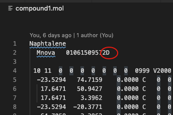

Normally, the character 21-22 of line 2 of .sdf and .mol files indicate if it is a 2D or 3D stucture. If neither "2d" or "3D" is found there, the third column of the atom coordinates at zero indicate a 2D stucture. (see lines 5 - always the same char position... - check which...)

